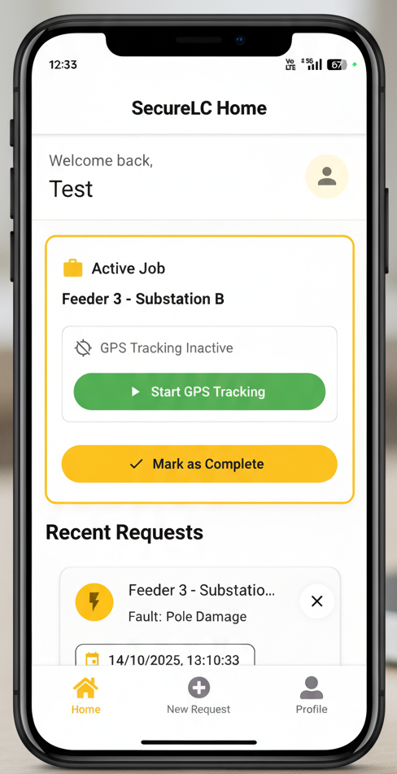
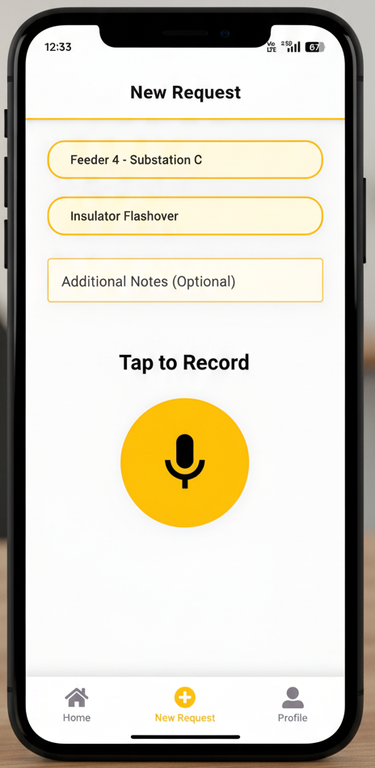

# SecureLC - Lineman Mobile App

[](https://opensource.org/licenses/MIT)
[](package.json)
[](app.json)

SecureLC is a comprehensive mobile application designed for linemen and field workers to manage line clear requests securely and efficiently. Built with React Native and Expo, the app integrates with Firebase for real-time data synchronization and Cloudinary for media storage. It is complemented by a supervisor web application for monitoring and management.

**Supervisor Website:** [secure-lc-superviser.vercel.app](https://secure-lc-superviser.vercel.app/)

**GitHub Repositories:**
* **Mobile App:** [github.com/ArmanAmreliya/SecureLC](https://github.com/ArmanAmreliya/SecureLC)
* **Supervisor Website:** [github.com/ArmanAmreliya/SecureLC---Superviser](https://github.com/ArmanAmreliya/SecureLC---Superviser)

---

## 📸 Screenshots

<p align="center">
  
  
</p>

---

## ✨ Features

SecureLC is packed with features designed to streamline the workflow of linemen and enhance safety and communication with supervisors.

* **Authentication & Security:**
    * **Firebase Authentication:** Secure email and password authentication.
    * **Biometric Login:** Support for Fingerprint/Face ID for quick and secure access after initial login.
    * **Password Reset:** "Forgot Password" functionality to allow users to reset their password via email.

* **Request Management:**
    * **Create & Submit Requests:** Linemen can create new line clear requests with details like substation, fault type, and additional notes.
    * **Audio Recording:** Attach voice notes to requests for detailed descriptions of the situation.
    * **Real-time Updates:** Requests are synchronized in real-time with the Firebase Firestore database.
    * **Status Tracking:** View the status of requests (Pending, Approved, Denied, Completed).
    * **Delete Requests:** Ability to delete requests with a confirmation prompt.

* **GPS Tracking:**
    * **Real-time Location Tracking:** When a job is active, the app can track the lineman's location in the background.
    * **Firestore Integration:** GPS data is saved to Firestore, allowing supervisors to monitor the location of field workers via a web app.
    * **Manual Control:** Linemen can manually start and stop GPS tracking for an active job.
    * **Status Display:** The app provides a visual indicator of the GPS tracking status (active/inactive) and displays current coordinates.

* **User Interface & Experience:**
    * **Professional Theme:** A clean, professional UI with a yellow and dark theme inspired by government applications.
    * **Intuitive Navigation:** A bottom tab navigator for easy access to Home, New Request, and Profile screens.
    * **User Profile:** A dedicated profile screen displays user information, including email, user ID, and account creation date.
    * **Success Overlays:** Animated success overlays provide clear feedback to the user after submitting a request.

---

## 🛠️ Tech Stack

* **Framework:** React Native with Expo
* **UI Library:** React Native Paper
* **Navigation:** React Navigation (Bottom Tabs and Native Stack)
* **Backend:** Firebase (Authentication, Firestore)
* **Media Storage:** Cloudinary
* **State Management:** React Context API
* **Language:** JavaScript (ES6+)

---

## 🚀 Getting Started

Follow these instructions to get a copy of the project up and running on your local machine for development and testing purposes.

### Prerequisites

* Node.js (v18+ recommended)
* npm or pnpm package manager
* Expo CLI (`npm install -g expo-cli`)
* Git

### Installation

1.  **Clone the repository:**
    ```bash
    git clone [https://github.com/ArmanAmreliya/SecureLC.git](https://github.com/ArmanAmreliya/SecureLC.git)
    cd SecureLC
    ```

2.  **Install dependencies:**
    ```bash
    # Using npm
    npm install
    ```

### Configuration

Before running the application, you need to set up your environment variables for Firebase and Cloudinary.

1.  **Firebase:**
    * Create a new project on the [Firebase Console](https://console.firebase.google.com/).
    * Enable **Authentication** (with Email/Password provider) and **Firestore**.
    * Copy your Firebase project configuration and replace the placeholder in `firebaseConfig.js`.

2.  **Cloudinary:**
    * Create an account on [Cloudinary](https://cloudinary.com/).
    * Find your `CLOUD_NAME`, `API_KEY`, `API_SECRET`, and create an `UPLOAD_PRESET`.
    * Update these values in `services/cloudinaryService.js`. You can also create a `.env` file in the root of the project with the following content:
        ```env
        CLOUDINARY_URL=cloudinary://<API_KEY>:<API_SECRET>@<CLOUD_NAME>
        ```

### Running the App

1.  **Start the development server:**
    ```bash
    npm start
    ```

2.  **Open the app:**
    * Scan the QR code with the Expo Go app on your mobile device.
    * Press `a` to open in an Android emulator.
    * Press `i` to open in an iOS simulator.
    * Press `w` to open in a web browser.

---

## 🔐 Login Credentials

To test the app, you can create a test user account in your Firebase project.

1.  Go to the [Firebase Console](https://console.firebase.google.com/).
2.  Navigate to your project, then to **Authentication** -> **Users**.
3.  Click **Add user** and create a new user. For example:
    * **Email:** `test@securelc.com`
    * **Password:** `password123`
    ---

## 📄 License

This project is licensed under the MIT License - see the [LICENSE](LICENSE) file for details.

---
Thank You !!
